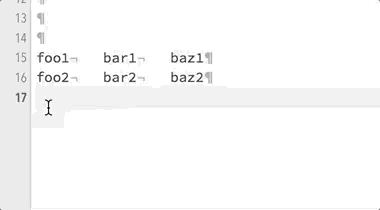

# ToMarkdownTable
A PopClip extension which converts tab separated text to Markdown's table format.

## Required
[PopClip for Mac](http://pilotmoon.com/popclip/)

## Installation

1. Clone this repository(or download .zip)
2. Double click **mdtable.popclipext**
3. Restart PopClip

**NOTE**: Since this is not an official extension, you will see the following alert. Choose 'Install "To markdown table"'.

## How to use

There are 2 ways to convert text.

|operation|action|
|---|---|
||Convert all lines as table contents, with blank header|
|⌥ + |Convert a first line as table header, the others as contents|

Select text, and choose  icon in PopClip bar. If the text includes tab characters, the extension converts it to multi columns table.

And if you select it with option(⌥) key, the first line of text is used as a table header. 

## Uninstallation
Remove **mdtable.popclipext** package from `/Library/Application Support/PopClip/Extensions`.

## License
MIT License.
