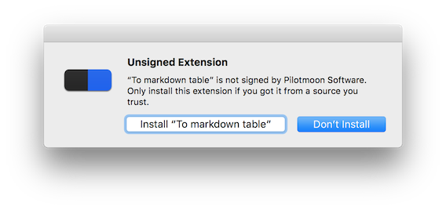

# ToMarkdownTable
A PopClip extension which converts tab separated text to Markdown's table format.

## Required
[PopClip for Mac](http://pilotmoon.com/popclip/)

## Installation

1. Clone this repository(or download .zip)
2. Double click **mdtable.popclipext**
3. Restart PopClip

**NOTE**: Since this is not an official extension, choose 'Install "To markdown table"'.

## How to use

There are 2 ways to convert text.

|operation|action|
|---|---|
||Convert all lines as table contents, with blank header|
|⌥ + |Convert a first line as table header, the others as contents|

Select text, and select  icon.
<!-- Add animated gif image -->

If you select it with option(⌥) key, the first line of text is used as a table header. 
<!-- Add animated gif image -->

## Uninstallation
Remove mdtable.popclipext from `/Library/Application Support/PopClip/Extensions`.

## License
MIT License.
